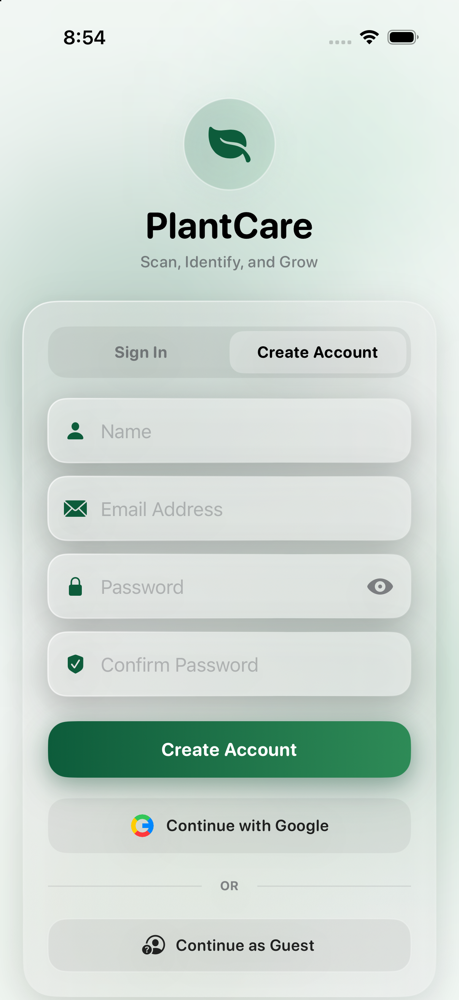

# 🌱 PlantCare — Scan, Identify, and Grow

<p align="center">
  
</p>

<p align="center">
  <strong>A modern native iOS application designed for plant lovers, urban gardeners, and botanists to identify plant species, diagnose plant health, and manage digital garden care.</strong>
</p>

<p align="center">
  
  
  
  
  
</p>

---

## 📖 Table of Contents
- [✨ Key Features](#-key-features)
- [📱 App Walkthrough & Screens](#-app-walkthrough--screens)
- [🏗️ Technical Architecture](#️-technical-architecture)
- [📦 Dependencies & Tech Stack](#-dependencies--tech-stack)
- [📂 Project Directory Structure](#-project-directory-structure)
- [🚀 Getting Started](#-getting-started)
  - [Prerequisites](#prerequisites)
  - [Installation & Clone](#1-clone-the-repository)
  - [API Keys & Configuration](#2-configure-api-keys)
  - [Firebase Setup](#3-firebase-configuration)
  - [Build and Run](#4-build-and-run)
- [🧪 Running Unit Tests](#-running-unit-tests)
- [👥 Team Members](#-team-members)
- [📄 License](#-license)

---

## ✨ Key Features

- 🌿 **AI Botanical Identification**: Uses the **Pl@ntNet REST API** to identify plant species from leaf, flower, fruit, or bark images with high precision confidence scoring.
- 🩺 **Health Diagnosis & Botanical Care**: Integrates the **Perenual API** to deliver personalized care metrics (watering intervals, sunlight needs, soil conditions, and life cycle).
- 💾 **Robust SwiftData Persistence**: Native iOS 17+ local-first persistence via `@Model SavedPlant`, ensuring full offline access even across cold app restarts.
- 🖼️ **High-Performance Image Storage**: Saves captured specimen photos directly to the app's secure sandboxed Documents directory (`ImageStorageService`), maintaining database speed.
- 🔐 **Multiple Authentication Modes**:
  - **Firebase Authentication** (Email & Password with validation)
  - **Google Sign-In** via `GoogleSignIn-iOS`
  - **Continue as Guest** (Zero friction, Apple Human Interface Guidelines compliant)
- 🎨 **Liquid Glassmorphism UI**: Beautiful, tactile interface using SwiftUI materials (`.ultraThinMaterial`), subtle border highlights, ambient botanical glow gradients, and haptic feedback.
- 🛡️ **Offline & Resilient Fallback**: Built-in `MockPlantService` ensures smooth demoing and offline operability even without active network or when API quotas are reached.

---

## 📱 App Walkthrough & Screens

| Screen | Description |
|---|---|
| **1. Authentication** | Supports Email/Password, Google Sign-In, and Apple HIG-compliant Guest access. |
| **2. Botanical Home** | Search flora, explore curated species (Monstera, Snake Plant, Fiddle Leaf Fig), and access quick care tips. |
| **3. Camera & Viewfinder** | Custom real-time camera viewfinder (`CameraManager`) and gallery photo picker (`PhotosPicker`) with organ selection. |
| **4. Identification Results** | Interactive match card showing top scientific match, confidence percentage, and alternative candidates. |
| **5. Plant Care Profile** | Four-quadrant care widget (Watering, Sunlight, Growth Cycle, Care Level) with "Save to My Garden" action. |
| **6. My Garden** | Searchable local botanical collection displaying saved plants, custom pictures, health status badges, and deletion controls. |

---

## 🏗️ Technical Architecture

PlantCare follows the **MVVM (Model-View-ViewModel)** architectural pattern with clean separation of concerns:

```
                      ┌───────────────────────┐
                      │    SwiftUI Views      │
                      │  (Home, Scan, Garden) │
                      └──────────┬────────────┘
                                 │
                                 ▼
                      ┌───────────────────────┐
                      │      ViewModels       │
                      │  (@Observable / Obs)  │
                      └──────────┬────────────┘
                                 │
            ┌────────────────────┼────────────────────┐
            ▼                                         ▼
┌────────────────────────┐               ┌────────────────────────┐
│   Services & Network   │               │   Persistence Layer    │
│  - PlantNetService     │               │  - SwiftData Context   │
│  - MockPlantService    │               │  - ImageStorageService │
│  - AuthManager         │               │  - Keychain & Defaults │
└────────────────────────┘               └────────────────────────┘
```

- **Declarative UI**: 100% SwiftUI with custom DesignSystem tokens (`DesignSystem.swift`, `LiquidGlassCard`, `PlantCareTheme`).
- **Swift Concurrency**: Modern `async`/`await`, `@MainActor` actors, and Task structured concurrency.
- **Data Flow**: Reactive observation and SwiftData `@Query` for instantaneous UI updates upon database changes.

---

## 📦 Dependencies & Tech Stack

Managed natively via **Swift Package Manager (SPM)**:

| Library | Version / Source | Purpose |
|---|---|---|
| **Firebase iOS SDK** | `11.15.0` | Firebase Core and Authentication |
| **GoogleSignIn-iOS** | `8.0.0` | Native Google Sign-In SDK |
| **Kingfisher** | `7.12.0` | Asynchronous image downloading and caching |
| **SwiftData** | Built-in (iOS 17+) | Object persistence replacing legacy Core Data |
| **AVFoundation** | Built-in | Custom camera capture session |

---

## 📂 Project Directory Structure

```
PlantCare/
├── PlantCare/
│   ├── App/
│   │   └── PlantCareApp.swift               # Application entrypoint & window configuration
│   ├── Assets.xcassets/                     # App icons, camera specimen, and colors
│   ├── Core/
│   │   ├── Config/
│   │   │   ├── APIConfig.swift              # Base URLs, API keys & environment loader
│   │   │   ├── Secrets.xcconfig.template    # Template for API keys & URL schemes
│   │   │   └── PlantCareSecrets.xcconfig   # Local secret configuration (git-ignored)
│   │   ├── DesignSystem/                    # Reusable UI tokens, fonts, and glassmorphic cards
│   │   └── Storage/
│   │       ├── ImageStorageService.swift    # Sandboxed local JPEG file manager
│   │       └── PersistenceController.swift  # SwiftData container initialization
│   ├── Models/
│   │   ├── PlantNetModels.swift             # Decodable models for Pl@ntNet & Perenual APIs
│   │   └── SavedPlant.swift                 # SwiftData @Model persistent entity
│   ├── Services/
│   │   ├── AuthManager.swift                # Firebase & Google Authentication manager
│   │   ├── PlantNetService.swift            # Dual REST API client (Pl@ntNet + Perenual)
│   │   └── MockPlantService.swift           # Deterministic offline mock service
│   ├── ViewModels/
│   │   ├── HomeViewModel.swift              # Home botanical feed and search logic
│   │   └── ScanViewModel.swift              # Camera, upload state, and analysis pipeline
│   └── Views/
│       ├── Auth/                            # Sign In, Create Account & Guest views
│       ├── Home/                            # Botanical dashboard & User Profile sheet
│       ├── Scan/                            # Camera viewfinder & organ selector
│       ├── Result/                          # Candidate matches & diagnosis cards
│       ├── Profile/                         # Full plant care specs & save action
│       ├── Garden/                          # My Garden SwiftData collection
│       └── MainTabView.swift                # Custom floating tab bar navigation
├── PlantCareTests/
│   └── PlantCareTests.swift                 # 9 unit & persistence test suites
├── docs/                                    # Setup guides, specs, and presentation manual
└── PlantCare.xcodeproj                      # Xcode project configuration
```

---

## 🚀 Getting Started

### Prerequisites
- **macOS Sonoma (14.0)** or later
- **Xcode 15.0+** (tested and compatible with Xcode 16 / 27)
- **iOS 17.0+** Simulator or physical device
- Active internet connection (for live API calls)

---

### 1. Clone the Repository

```bash
git clone https://github.com/kaungwaiyan96/PlantCare.git
cd PlantCare
```

---

### 2. Configure API Keys

The app uses `PlantCareSecrets.xcconfig` for securing private API credentials:

1. Duplicate the template file:
   ```bash
   cp PlantCare/Core/Config/Secrets.xcconfig.template PlantCare/Core/Config/PlantCareSecrets.xcconfig
   ```
2. Open `PlantCare/Core/Config/PlantCareSecrets.xcconfig` and add your keys:
   ```properties
   // Pl@ntNet API Key (https://my-api.plantnet.org)
   PLANTNET_API_KEY = "your_plantnet_api_key_here"

   // Perenual API Key (https://perenual.com/docs/api)
   PERENUAL_API_KEY = "your_perenual_api_key_here"

   // Google Reversed Client ID from GoogleService-Info.plist
   GOOGLE_REVERSED_CLIENT_ID = com.googleusercontent.apps.YOUR_CLIENT_ID
   ```

> 💡 *Note: Even without live API keys, the app seamlessly defaults to the built-in offline botanical catalog.*

---

### 3. Firebase Configuration

1. Download your `GoogleService-Info.plist` from the [Firebase Console](https://console.firebase.google.com/).
2. Place `GoogleService-Info.plist` in the `PlantCare/` folder.
3. In Xcode, ensure `GoogleService-Info.plist` is targeted under **Target Membership → PlantCare**.
4. Refer to [`docs/FIREBASE_AUTH_SETUP.md`](docs/FIREBASE_AUTH_SETUP.md) for step-by-step instructions.

---

### 4. Build and Run

#### In Xcode:
1. Open `PlantCare.xcodeproj` in Xcode:
   ```bash
   open PlantCare.xcodeproj
   ```
2. Wait for Swift Package Manager to resolve all dependencies.
3. Select the **PlantCare** scheme and an **iOS 17+ Simulator** (e.g., iPhone 17 or iPhone 15 Pro).
4. Press `Cmd + R` to build and run.

#### Via Command Line:
```bash
# Build project
xcodebuild build \
  -project PlantCare.xcodeproj \
  -scheme PlantCare \
  -destination 'platform=iOS Simulator,name=iPhone 17' \
  -configuration Debug

# Run tests
xcodebuild test \
  -project PlantCare.xcodeproj \
  -scheme PlantCare \
  -destination 'platform=iOS Simulator,name=iPhone 17'
```

---

## 🧪 Running Unit Tests

The test suite thoroughly verifies persistence, decoding, and application logic:
- `testSwiftDataPersistence`: Validates `@Model SavedPlant` insertion, query, and constraint verification in an in-memory `ModelContainer`.
- `testImageStorageSaveAndLoad`: Tests atomic file saving, retrieval, and disk deletion in the app sandbox.
- `testPlantNetCodableDecoding`: Ensures schema alignment with live Pl@ntNet JSON payloads.
- `testPerenualCodableDecoding`: Confirms Perenual care attributes parsing.
- `testMockPlantServiceFlow`: Verifies end-to-end identification, care retrieval, and health diagnostics under zero-network conditions.
- `testAuthPersonalizationFlow` & `testUserProfileUpdateAndAvatarPersistence`: Tests user session and custom profile image caching.
- `testSaveToGardenFlowAndTabTransition`: Tests reactive SwiftData insertion flow.
- `testScanPlantViewInitializationAndViewModelState`: Validates state machine in `ScanViewModel`.

Run tests directly in Xcode with `Cmd + U`.

---

## 👥 Team Members

- **Mi Hnin Au Shwe Yee** (Student ID: `6632723`) — *Project Overview & Botanical Domain*
- **Kaung Wai Yan** (Student ID: `6632722`) — *UI/UX Architecture & Persistence Engineering*
- **Ye Nay Thway** (Student ID: `6736539`) — *Technical Architecture, API Integration & Security*

---

## 📄 License

This project is licensed under the [MIT License](LICENSE) — see the repository files for details.
